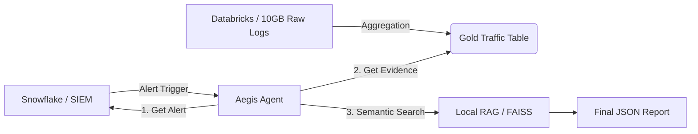

# Aegis: Cloud-Native AI SOC Agent 🛡️🤖

**A Federated Security Analyst that bridges Snowflake (SIEM) and Databricks (Data Lake) using AI.**


---

## 🚨 The Problem
Modern Security Operations Centers (SOCs) face "Data Gravity" issues:
1.  **SIEMs (Snowflake/Splunk)** are fast but expensive. Storing Petabytes of raw PCAP/Netflow logs here is bankrupting.
2.  **Data Lakes (Databricks)** are cheap and vast, but hard to query for real-time alerts.
3.  **Analysts** are stuck in the middle, manually copying IPs from the SIEM and searching them in the Lake.

## 💡 The Solution: Aegis
Aegis is an **Agentic AI** that automates this workflow using a **Federated Architecture**:
1.  **Listen**: Detects High-Fidelity Alerts in **Snowflake**.
2.  **Investigate**: Automatically queries **Databricks** to fetch the heavy forensic evidence (Volume, Packet Counts) for that specific specific IP.
3.  **Enrich**: Uses **RAG (Retrieval Augmented Generation)** to map alert terms to **MITRE ATT&CK** Techniques.
4.  **Triage**: Generates a JSON Triage Package containing Context + Evidence + Threat Intel.

---

## 🏗️ Architecture



## 🛠️ Tech Stack
*   **Orchestrator**: LangGraph (Stateful Python Agent)
*   **SIEM / Identity**: Snowflake (`FACT_ALERTS`, `DIM_USERS`)
*   **Data Lake / Forensics**: Databricks SQL (`gold_network_telemetry`)
*   **AI / RAG**: `sentence-transformers` (HuggingFace) + `FAISS` (Vector DB)
*   **Security**: Custom `SQLGuardrail` to prevent Injection.

## 🚀 How to Run

### 1. Prerequisites
*   Python 3.10+
*   Snowflake Account (Standard/Trial)
*   Databricks Account (Standard/Trial)

### 2. Installation
```bash
git clone https://github.com/sazzad2024/cloud-native-soc-agent.git
cd cloud-native-soc-agent
pip install -r requirements.txt
```

### 3. Configuration
Copy the example environment file and fill in your Cloud credentials:
```bash
cp .env.example .env
# Edit .env with your Keys
```

### 4. Setup Data (Simulation)
```bash
# 1. Setup Snowflake (Tables & Alerts)
python utils/seed_snowflake_real.py

# 2. Setup Databricks (Gold Tables)
python utils/seed_databricks.py
```

### 5. Run the Agent
```bash
python main_agent.py
```

## 📊 Sample Output
```json
{
  "status": "Auto-Triaged",
  "alert": {
    "id": 1003,
    "src_ip": "18.218.229.235",
    "attack_cat": "Exploits",
    "severity": "High"
  },
  "evidence": {
    "traffic_volume": "368.3 MB",
    "packet_count": 58000
  },
  "mitre_mapping": [
    "Exploits (T1588.005)"
  ]
}
```

---
**Created by [Sazzad]** - *Open for collaboration on Enterprise AI Security Architectures.*
